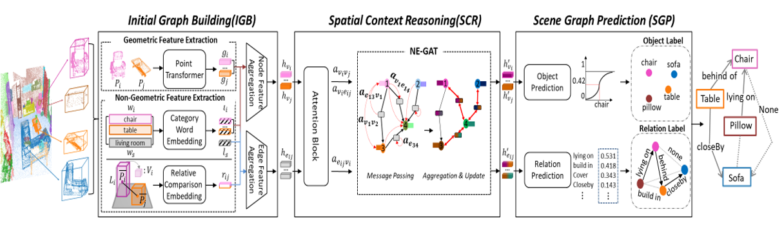
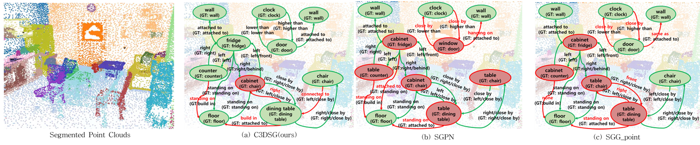

# C3DSG: 실내 환경 포인트 클라우드를 이용한 3차원 장면 그래프 생성 모델
**C3DSG: A 3D Scene Graph Generation Model Using Point Clouds of Indoor Environment**
**(Journal of KIISE, 2023)**
###### [[Paper]](https://drive.google.com/file/d/1rgfzc_s_IF5YvfprtcvLstwy20YMGpNb/view?usp=sharing)

- 

---

## Introduction

제안된 모델은 **Point Transformer**를 이용하여 3D 포인트 클라우드에서 **기하학적 특징**뿐만 아니라, **언어적 특징**과 **상대적 비교 특징**과 같은 다양한 **비-기하학적 특징**을 함께 활용합니다.
또한, 물체 간의 **공간적 맥락 정보**를 효과적으로 추출하기 위해, **NE-GAT 그래프 신경망**을 이용하여 물체 노드와 간선 모두에 **주의집중 메커니즘**을 적용합니다.

---

## Dependencies

```bash
conda create -n csggn python=3.8
conda activate csggn
pip install -r requirements.txt
pip install torch==1.12.1+cu113 torchvision==0.13.1+cu113 torchaudio==0.12.1 --extra-index-url https://download.pytorch.org/whl/cu113
pip install torch-scatter -f https://pytorch-geometric.com/whl/torch-1.12.1+cu113.html
pip install torch-sparse -f https://pytorch-geometric.com/whl/torch-1.12.1+cu113.html
pip install torch-spline-conv -f https://pytorch-geometric.com/whl/torch-1.12.1+cu113.html
pip install torch-geometric
```

---

## Prepare

### 3RScan Dataset

1. **3RScan 다운로드**
   - [3RScan GitHub 링크](https://github.com/ShunChengWu/3DSSG)
   - 3RScan 이용 약관에 동의한 후, 다운로드 스크립트를 받아 3RScan 메인 디렉토리에 위치
   - 데이터 준비 실행:
     ```bash
     python scripts/RUN_prepare_dataset_3RScan.py --download --thread 8
     ```
   - 데이터 다운로드:
        ```bash
        python scripts/RUN_prepare_GT_setup_3RScan.py --thread 16
        ``` 
---

### Trained Models

- **Word Embedding** 
  - [Glove6B_50d](https://drive.google.com/drive/folders/1dHZWWJyC1CSce_ZwBhJModz2EnuCJVTl?usp=sharing) `/CSGGN/word_embeddings/glove~.txt` 

- **사전-학습된 포인트 특징 추출기**
  - [PTv1](https://drive.google.com/file/d/1UgZrsZ-OI5w6ZAQ7l6lZdttu5M_ZYDs5/view?usp=sharing): `/CSGGN/backbone_checkpoints/PTv1/best_model.pth` 

- **최종 모델 가중치 (Epoch 300)**
  - [CSGGN](https://drive.google.com/drive/folders/1ziabo_sPnydgK8VWLNIAvLhTrOgn6NOK?usp=sharing): `/CSGGN/csggn_result/`

- **논문 속 실험 1 ~ 4 결과 (Epoch 300)**
  - [Experiments](https://drive.google.com/drive/folders/1AGxAHfqAjAyOvNawHT97-AitRrmwM5Cb?usp=sharing): `/CSGGN/Experiments/` 
---

## Run Code

### Train 
```bash
python main.py --mode train --config /CSGGN/configs/config_CSGGN
```

### Evaluate 
```bash
python main.py --mode eval --config /CSGGN/configs/config_CSGGN
```
---
## Result

- 

---

## Paper

```bibtex
@article{백호준2023c3dsg,
  title={C3DSG: 실내 환경 포인트 클라우드를 이용한 3 차원 장면 그래프 생성 모델},
  author={백호준 and 김인철},
  journal={정보과학회논문지},
  volume={50},
  number={9},
  pages={758--770},
  year={2023}
}
```

---

## Acknowledgement

제안 모델은 [3DSSG](https://github.com/ShunChengWu/3DSSG) 및 [PointTransformer](https://arxiv.org/abs/2012.09164)의 일부 코드를 기반으로 구현되었습니다.
